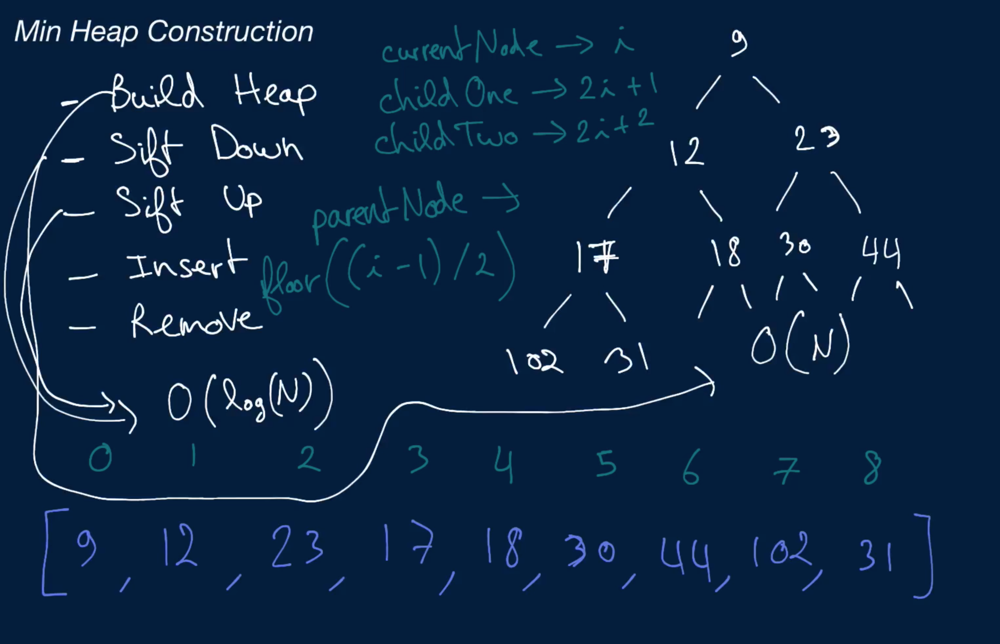

# Min Heap Construction

Implement a MinHeap class that supports:

   - Building a Min Heap from an input array of integers.
   - Inserting integers in the heap.
   - Removing the heap's minimum / root value.
   - Peeking at the heap's minimum / root value.
   - Sifting integers up and down the heap, which is to be used when inserting and removing values.
   
Note that the heap should be represented in the form of an array.

If you're unfamiliar with Min Heaps, we recommend watching the Conceptual Overview section of this question's video explanation before starting to code.

## Sample Usage

```
array = [48, 12, 24, 7, 8, -5, 24, 391, 24, 56, 2, 6, 8, 41]

// All operations below are performed sequentially.
MinHeap(array): - // instantiate a MinHeap (calls the buildHeap method and populates the heap)
buildHeap(array): - [-5, 2, 6, 7, 8, 8, 24, 391, 24, 56, 12, 24, 48, 41]
insert(76): - [-5, 2, 6, 7, 8, 8, 24, 391, 24, 56, 12, 24, 48, 41, 76]
peek(): -5
remove(): -5 [2, 7, 6, 24, 8, 8, 24, 391, 76, 56, 12, 24, 48, 41]
peek(): 2
remove(): 2 [6, 7, 8, 24, 8, 24, 24, 391, 76, 56, 12, 41, 48]
peek(): 6
insert(87): - [6, 7, 8, 24, 8, 24, 24, 391, 76, 56, 12, 41, 48, 87]
```

### Hints

```
Hint 1
For the buildHeap(), remove(), and insert() methods of the Heap, you will need to use the siftDown() and siftUp() methods. These two methods should essentially allow you to take any node in the heap and move it either down or up in the heap until it's in its final, appropriate position. This can be done by comparing the node in question to its child nodes in the case of siftDown() or to its parent node in the case of siftUp().
```

```
Hint 2
In an array-based Heap, you can easily access a node's children nodes and parent node by using the nodes' indices. If a node is located at index i, then its children nodes are located at indices 2 * i + 1 and 2 * i + 2, and its parent node is located at index Math.floor((i - 1) / 2).
```

```
Hint 3
To implement the buildHeap() method, you can either sift every node in the input array down to its final, correct position, or you can sift every node in the input array up to its final, correct position. What are the runtime implications of both approaches? Which methods (siftDown() or siftUp()) will insert() and remove() utilize? What about peek()?
```

```
Optimal Space & Time Complexity
BuildHeap: O(n) time | O(1) space - where n is the length of the input array SiftDown: O(log(n)) time | O(1) space - where n is the length of the heap SiftUp: O(log(n)) time | O(1) space - where n is the length of the heap Peek: O(1) | O(1) Remove: O(log(n)) time | O(1) space - where n is the length of the heap Insert: O(log(n)) time | O(1) space - where n is the length of the heap
```


