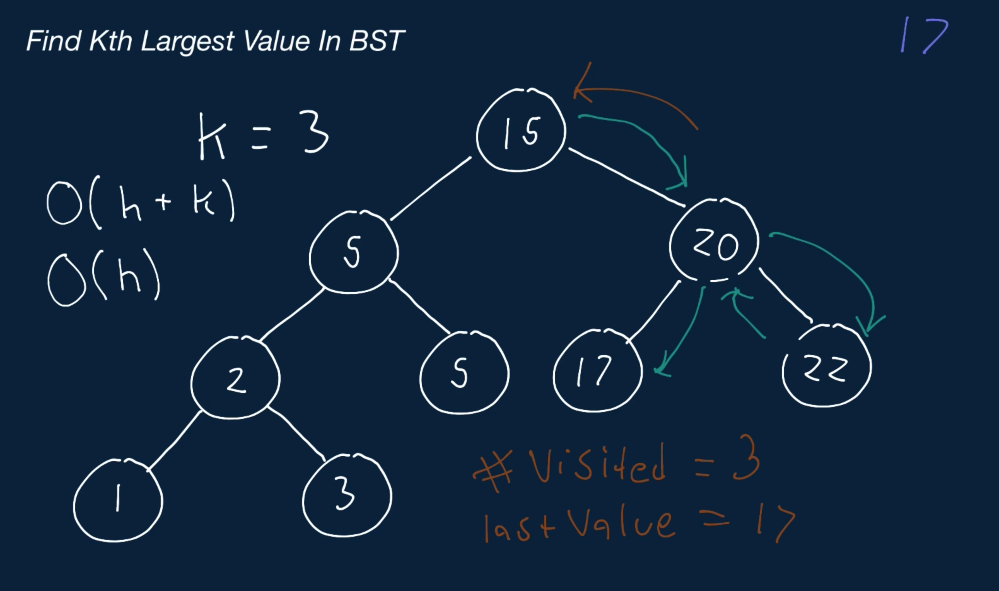

# Find Kth Largest Value In BST

Write a function that takes in a Binary Search Tree (BST) and a positive integer k and returns the kth largest integer contained in the BST.

You can assume that there will only be integer values in the BST and that k is less than or equal to the number of nodes in the tree.

Also, for the purpose of this question, duplicate integers will be treated as distinct values. In other words, the second largest value in a BST containing values {5, 7, 7} will be 7—not 5.

Each BST node has an integer value, a left child node, and a right child node. A node is said to be a valid BST node if and only if it satisfies the BST property: its value is strictly greater than the values of every node to its left; its value is less than or equal to the values of every node to its right; and its children nodes are either valid BST nodes themselves or None / null.

## Sample Input
```
tree =   15
       /     \
      5      20
    /   \   /   \
   2     5 17   22
 /   \         
1     3       
k = 3
```

## Sample Output
```
17
```

### Hints

```
Hint 1
Make sure to consider the fact that the given tree is a Binary Search Tree—not just a regular Binary Tree. How does this fact help you solve the problem in a more optimal time complexity?
```

```
Hint 2
The brute-force approach to this problem is to simply perform an in-order traversal of this BST and to store all of its node' values in the order in which they're visited. Since an in-order traversal of a BST visits the nodes in ascending order, the kth value from the end of the traversal order will be the kth largest value.
```

```
Hint 3
You can actually solve this problem in O(h + k) time, where h is the height of the tree. Rather than looking at the nodes in ascending order, you should look at them in descending order.
```

```
Hint 4
To solve this problem in O(h + k) time as mentioned in Hint #3, you need to perform a reverse in-order traversal. Since you'll be looking at nodes in descending order, you can simply return the kth visited node in the reverse in-order traversal.
```

```
Optimal Space & Time Complexity
O(h + k) time | O(h) space - where h is the height of the tree and k is the input parameter
```



