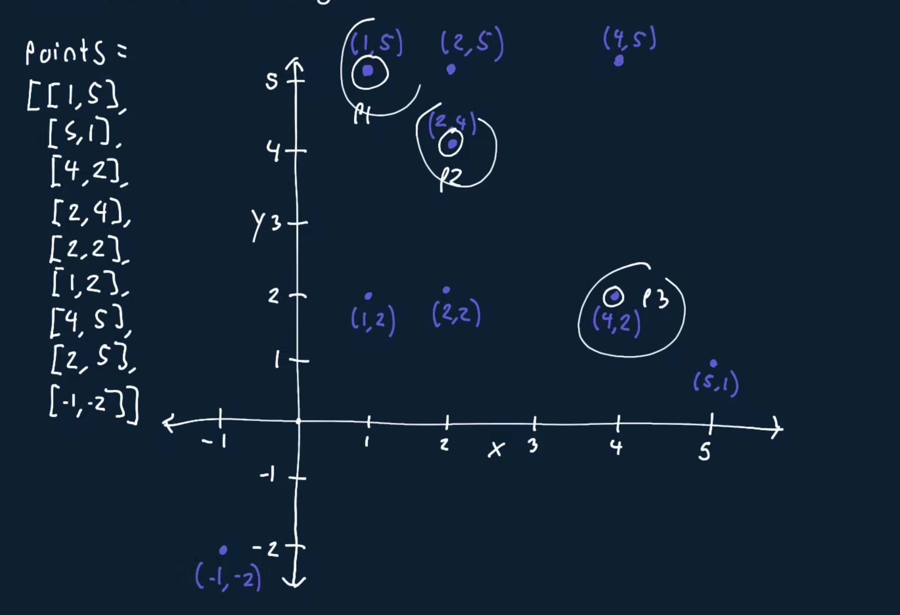

# Minimum Area Rectangle

You're given an array of points plotted on a 2D graph (the xy-plane). Write a function that returns the minimum area of any rectangle that can be formed using any 4 of these points such that the rectangle's sides are parallel to the x and y axes (i.e., only rectangles with horizontal and vertical sides should be considered--no rectangles with diagonal sides). If no rectangle can be formed, your function should return 0.

The input array will contain points represented by arrays of two integers [x, y]. The input array will never contain duplicate points.

## Sample Input

``` 
points =
[
    [1, 5],
    [5, 1],
    [4, 2],
    [2, 4],
    [2, 2],
    [1, 2],
    [4, 5],
    [2, 5],
    [-1, -2],
]
```

## Sample Output

```
3
// The rectangle with corners [1, 5], [2, 5], [1, 2], and [2, 2]
// has the minimum area: 3.
```

### Hints

Hint 1
> The brute-force approach to this problem is to simply generate all possible combinations of 4 points and to see if they form a rectangle. You can calculate the area of all of these rectangles and then return the minimum area that you find. Is there a better approach than this?

Hint 2
> A more optimal approach is to find vertical or horizontal edges that are parallel to the y or x axes, respectively. If you find two parallel edges (two vertical edges, for example) that share a vertical or horizontal coordinate (y values in the case of vertical edges), then those edges form a rectangle.

Hint 3
> Another approach is to pick any two points that don't have the same x or y values (i.e., points that could be at opposite ends of a rectangle diagonal) and to see if you can create a rectangle with them and two other points. Given two points where p1 = (x1, y1) and p2 = (x2, y2), if points p3 = (x1, y2) and p4 = (x2, y1) exist, then these 4 points form a rectangle.

```
Optimal Space & Time Complexity
O(n^2) time | O(n) space - where n is the number of points
```

